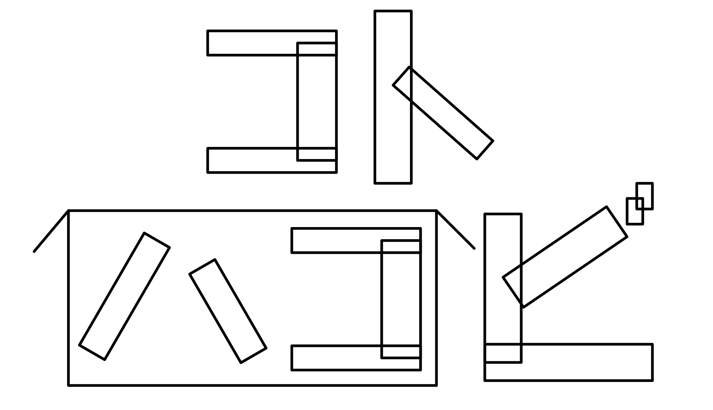

# ハックツハッカソン アロカップ



## 概要

- インターネット接続を必要としないメッセージ交換アプリ
- Bluetoothを使ったローカル通信
- アソビ心

## 詳細

### 技術スタック

#### アプリ

- [Electron](https://www.electronjs.org/ja/) (メインフレームワーク)
  - [React](https://ja.react.dev/) (レンダラー側)
    - [PixiJS](https://pixijs.com/) (WebGLレンダラー)
  - [Node.js](https://nodejs.org/ja) (ユーティリティ側)
    - [stoprocent/bleno (fork)](https://github.com/stoprocent/bleno) (BLE発信側)
    - [stoprocent/noble (fork)](https://github.com/stoprocent/noble) (BLE受信側)

#### 開発環境

- [Vite+](https://viteplus.dev/)
- [pnpm](https://pnpm.io/ja/)

### 用語整理

- **レンダラー側**：ElectronのChromium, React等の見える部分 (フロントエンド)
- **ユーティリティ側**：ElectronのNode.js等のデータ処理を行う部分 (バックエンド)

#### レンダラー側

- UIを表示する
  - メイン画面比率：5:3 (3DSと同じ)
- 入力を処理する
  - 独自実装のソフトウェアキーボードで入力 (現状: ひらがな・全角カタカナ・全角数字・記号。全角アルファベット／制御コードは将来追加予定で現状未対応)
- ユーティリティを呼び出す
- レンダリング解像度を低くして3DSみたいにしたい

#### ユーティリティ側

- Bluetooth関連のプロセスを管理する
  - BLE発信・受信
    - `LocalName: ALLO`
    - 1パケットにつき自由に動かせるのは16Byte
    - セッションID 4Byte, 文字順(seq) 2Byte, 文字コード(body) 10Byte (1パケット=1文字)
- 文字コードを生成する
  - ひらがな・カタカナ・全角数字・記号(！？、。〜ー等, すべて全角で扱う)。制御コード(開始・終了)は保留
- 文字コードを使ったエンコード・デコードを行う
- 文字コードを生成するための自然乱数を生成する

## 環境構築

### 事前準備

以下のツールの事前導入が必要です。
- Node.js (npm)
- pnpm
- Vite+

#### 簡単インストール(for macOS)

```zsh
# Node.js
brew install node

# pnpm
curl -fsSL https://get.pnpm.io/install.sh | sh -

# Vite+
curl -fsSL https://vite.plus | bash
```

#### (追加) PixiJS Skills
```zsh
# https://pixijs.com/llms
npx skills add https://github.com/pixijs/pixijs-skills
```

### アプリ構築

```zsh
# アプリディレクトリに移動
cd allo-app/

# パッケージインストール
vp install

# 開発サーバー起動 (Electronアプリも起動します)
vp dev

```

---

# その他情報

## チーム 「ガらパごスらぼ」

### メンバー / Member

- @henohenon
- @kurazuuuuuu

---

> [!NOTE]
> Doorkeeperにてイベント情報が確認可能です。<br>
> https://hackz-community.doorkeeper.jp/events/196580

---